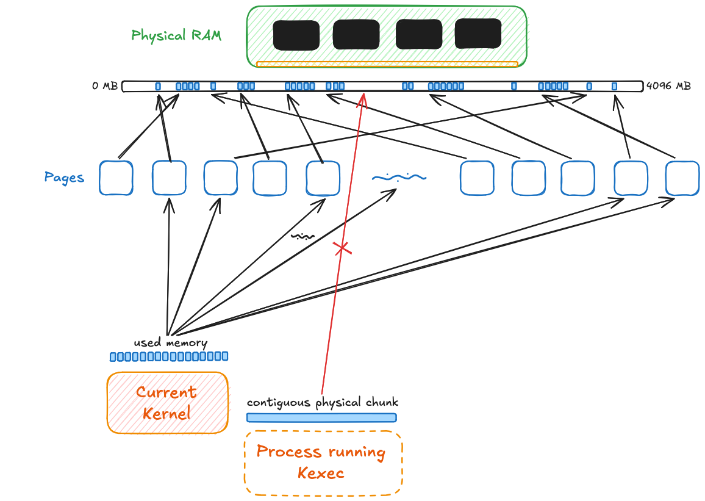

## Intro

> NOTE:
> This is based on aarch64.

From the time we power on a system, firmware(UEFI) takes over, initializes hardware and drivers to make way for a bootloader(GRUB or systemd-boot) to take over, the bootloader runs on top of UEFI and makes way for the linux kernel to start.

## kexec

`kexec` is a linux syscall that lets you boot into a kernel from a running kernel. Here, the running kernel acts as a bootloader for another linux kernel. This implies that the hardware initialization phase is skipped. 

This is done in two phases:
1. kexec_file_load(): prepares for the handoff.
2. reboot() pulls off the actual handoff.

In the first phase, kernel, initrd, hardware description(DTB) is recorded into kexec segments. Each segment has data and future physical address. These are ordered to satisfy the architecture's boot layout. This planned layout is created in memory so as to not disrupt the current kernel occupied memory.

In the second phase, the reboot sycall has to be invoked with LINUX_REBOOT_CMD_KEXEC flag. During this, the core kernel subsystems are turned off, all the cpu cores other than the one that is running these operations are shut off. After this, the relocation from the kexec segments to actual physical memory according to the boot layout is executed and this marks as the point of no return. Now the cpu is made to jump on the new kernel entry point after setting up DTB in x0 register.

> NOTE:
> Also, there's a crashkernel path, where a contiguous chunk of memory is reserved in advanced for next kernel jump.

## Why?

The most obvious use of kexec is faster rebooting. Since firmware and bootloader initialization are skipped, the machine can transition into same kernel more quickly.

In other cases where Linux is used as a bootloader, Linux provides a significantly more mature and battle-tested driver environment than most firmware implementations which makes it better in terms of security and reliability aspect.

(LinuxBoot)[https://book.linuxboot.org/components.html] LinuxBoot is an example of this idea. It replaces large parts of late-stage firmware functionality with a Linux kernel and a small userspace.

(crash recovery in progress)

## How to?

(in progress)

## References

(in progress)